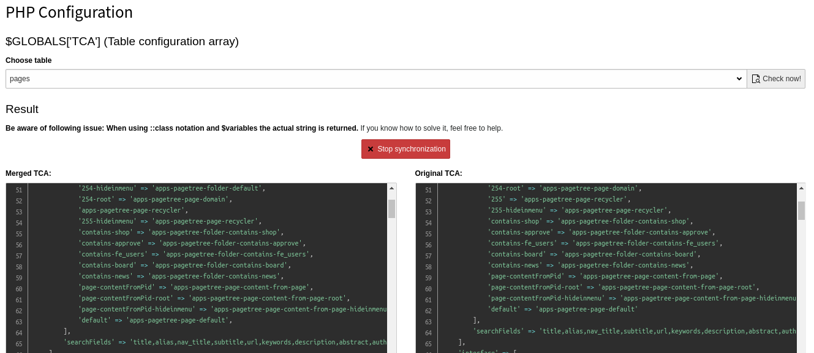

.. every .rst file should include Includes.txt
.. use correct path!

.. include:: Include.txt

.. Every manual should have a start label for cross-referencing to
.. start page. Do not remove this!

.. _start:

=============================================================
TYPO3 Upgrade Assistant
=============================================================

:Extension key:
   ama_t3_upgrade_assistant

:Version:
   1.0.4

:Language:
   en

:Copyright:
   2019-2019

:Authors:
    Alexander Nostadt

**About this extension**
    This extension aims to simplify the upgrade process. In a first step it provides a be module displaying merged TCA.

**Example**

   Backend with table "pages"

**Table of contents**

.. toctree::
    :glob:
    :titlesonly:

    *
